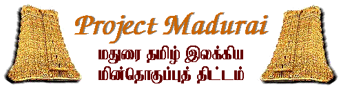

# பொன்னியின் செல்வன்

### வரலாற்றுப் புதினம்

## அமரர் கல்கி கிருஷ்ணமூர்த்தி

---

#### எழுத்தாக்கம்

* Etext in Tamil Script - TSCII format (v. 1.7)
* Etext preparation: Mr. Bhaskaran Sankaran and colleagues of Anna University - KBC Research Center, MIT - Chrompet Campus, Chennai, India.
* Proof-reading: Mr. S. Anbumani, Mr. N.D. Logasundaram, Mr. Narayanan Govindarajan, Ms. Pavithra Srinivasan, Mr. Ramachandran Mahadevan, Ms. Sathya, Mr. Sreeram Krishnamoorthy, Dr. Sridhar Rathinam, Mrs. Srilatha Rajagopal, Mr. Vinoth Jagannathan Etext prep. in html/web version: Mr. S. Anbumani, Blacksburg, Virginia, USA
* Etext prep in pdf format: Dr. K. Kalyanasundaram, Lausanne, Switzerland

* © Project Madurai 2003
* You are welcome to freely distribute this file, provided this header page is kept intact.
